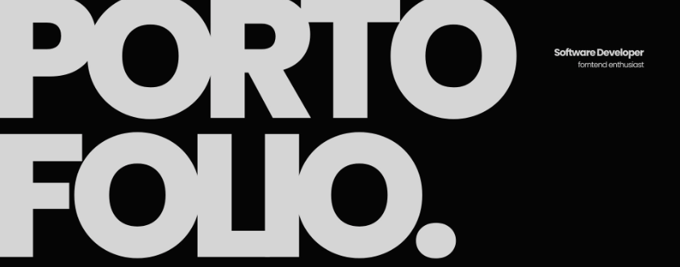

<!-- 

  

 -->
<h1>Hi 👋 I'm Software developer</h1>

<h3>
 Frontend Developer  
 
  Programming Fundamentals with C++   
Problem Solver
    
  • Solved <b>50+</b> Programming Problems
</h3>

---

## 👨‍💻 About Me
- 👨‍🎓 Learning **Js backend && Next.js**
  
- ✅ Completed **Structured Programming**
- 🧠 Solved **50+ Programming Problems**
- 🎯 Strong focus on **logic building & problem solving**
- ✍️ Writing **clean & readable code**
- 🚀 Planning to learn **Design patterns, Next.js** next

---

## 🧑‍💻 Programming Languages

    
  

  
  

---

## 🛠️ Tools & Editors

  
  
  

---

## 📚 Current Learning Path
- 🔹 Advanced C++ Basics
- 🔹 Problem Solving Practice
- 🔹 Writing clean & readable code
- 🔜 Object-Oriented Programming (OOP)
- 🔜 Data Structures

---

## 🏆 Achievements
- ✅ Solved **50+ Programming Problems** using C++
- 🔥 Strong foundation in **Problem Solving & Logic**
- 💡 Continuous daily practice & improvement mindset

---

## 🌐 Connect With Me

---

## 🧩 Problem Solving Mindset
- 🧠 Think first, code second
- ✍️ Understand the problem before writing any line
- 🔁 Practice consistently
