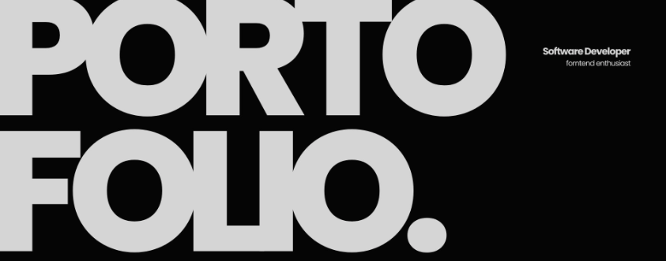

<!--   -->

 

<h1>Hi 👋 I'm Gamila</h1>

<h3>
Frontend Developer | React · Next.js · JavaScript
 
Building AI-powered Web Applications & Chatbots
 
Learning RAG, LangChain & AI Application Development
</h3>

I build responsive, practical web applications with a focus on clean code,
reusable components, API integration, and modern frontend architecture.

---

## 👨‍💻 About Me

* 💻 Frontend Developer focused on **React.js, Next.js, and JavaScript**
* 🤖 Currently learning **RAG, LangChain, LLM APIs, and AI-powered applications**
* 🗄️ Experience building applications with **Supabase and PostgreSQL**
* 🧩 Interested in building practical **AI-powered products and SaaS applications**
* ✍️ I care about writing **clean, readable, and maintainable code**
* 🧠 Strong interest in **problem solving and software development fundamentals**
* 📫 Email: **[gameliadeveloper@gmail.com](mailto:gameliadeveloper@gmail.com)**

---

## 🛠️ Tech Stack

### Frontend

  
  
  
  
  
  

### Backend & Data

  
  <!--  -->
  
  

### AI & Tools

  
  
  
  
  
  

---

## 🚀 What I Build

* ⚡ Modern **React & Next.js applications**
* 🧩 Reusable UI components and frontend architecture
* 🔌 REST API integrations and asynchronous data handling
* 🗄️ Database-driven applications with **Supabase / PostgreSQL**
* 🤖 AI-powered applications and chatbot interfaces
* 🔎 Exploring **RAG, embeddings, and LLM-powered features**
* 📱 Responsive and user-focused web experiences

---

## 🧪 Code Samples

A collection of focused code samples demonstrating practical development patterns:

* 🔹 [React `useDebounce` Hook](https://gist.github.com/GamilaCoding/d728727fc7e40636b2771e5a61e62bc4)
* 🔹 [Reusable API Request Utility](https://gist.github.com/GamilaCoding/274fc4db666a8028841888e431320806)
* 🔹 [Supabase Products Query](https://gist.github.com/GamilaCoding/689c691053b9c228c997c6c0fbd95900)
* 🔹 [Next.js Route Protection with Middleware](https://gist.github.com/GamilaCoding/472ef026fc2d5876e6c3d8410eec0706)
* 🔹 [Reusable Form Validation Utility](https://gist.github.com/GamilaCoding/f3393750454e7b27f905f2b0b3236ff0)

> Small, focused examples of reusable patterns and problem-solving approaches used in web application development.

---

## 📚 Current Learning Path

* 🔹 Advanced **React & Next.js**
* 🔹 Python for AI application development
* 🔹 **RAG (Retrieval-Augmented Generation)**
* 🔹 LangChain and LLM application patterns
* 🔹 AI Agents and tool-based workflows
* 🔹 Vector databases and embeddings
* 🔹 Writing clean, maintainable, production-oriented code
* 🔹 Problem Solving & Data Structures

---

## 🏆 Highlights

* ✅ Built multiple **React / Next.js web applications**
* ✅ Experience with **Supabase-backed applications**
* ✅ Building and experimenting with **AI-powered applications**
* ✅ Continuous problem-solving and programming practice
* ✅ Focused on learning through real-world projects

---

## 🌐 Connect With Me

---

## 🧩 Problem Solving Mindset

* 🧠 Think first, code second
* ✍️ Understand the problem before implementing a solution
* 🔍 Break complex problems into smaller parts
* 🔁 Practice consistently and improve through real projects
* 🧹 Prefer simple, readable, and maintainable solutions
